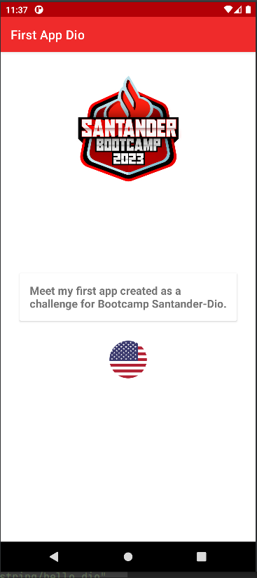
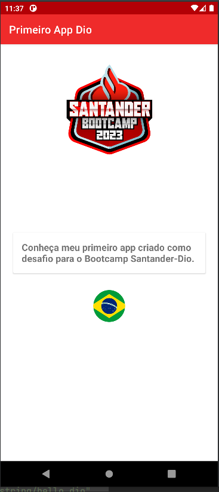

# Primeiro App Dio | Santander Bootcamp

Meu nome é Jessica Lobo, sou formada em Pedagogia, profissão em que trabalhei mais de 10 anos,
mas atualmente estudo programação e busco novas experiências para migrar de profissão. 
Já fiz e ainda faço cursos de Kotlin e Android e nesse momento estou participando do Bootcamp 
do Santander.

Esse projeto é um app simples com internacionalização e apenas uma activity mostrando o texto 
principal em diferentes linguagens de acordo com a linguagem do dispositivo. 
Aproveitei e adicionei as bandeiras dos países de forma que mudem também de acordo com a linguagem.

